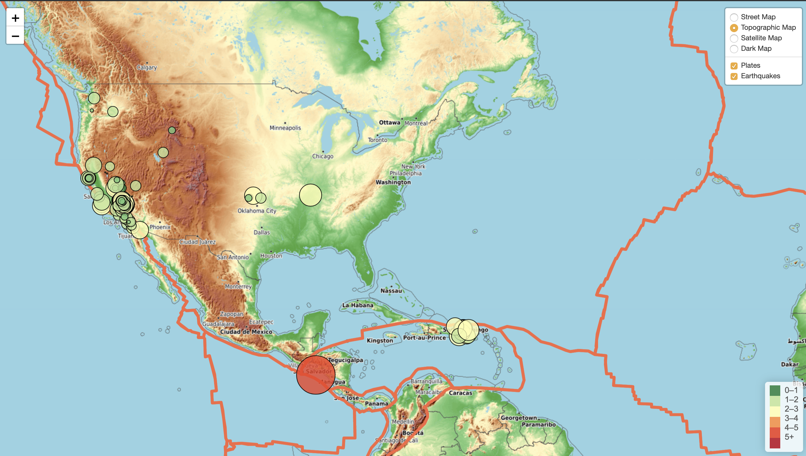

# USGS Earthquake Map 
 

## Objective 

Visualize live data from the USGS API on siesmic activity with leaflet.js  

The data represents all Earthquake activity recorded by the USGS and updated every minute.  

The heatmap contains layers to illustrate the location of tectonic plates (represented by the red lines) and geographic features (topographic map layer) to the siesmic activity.  

The size and color of the data circles represent the magnitude of each quake. 

 

## Technologies 

- [GEOJSON](http://earthquake.usgs.gov/earthquakes/feed/v1.0/geojson.php) 

- [leaflet.js](https://leafletjs.com/download.html)  

- [d3.js](https://github.com/d3/d3/wiki) 

- [USGS API] (https://earthquake.usgs.gov/earthquakes/feed/v1.0/summary/all_day.geojson) 

## Explore 

1.) Create and initialize a new [virtual enviornment](https://uoa-eresearch.github.io/eresearch-cookbook/recipe/2014/11/20/conda/) 

2.) Download install related technologies and dependencies (listed above)  

3.) Clone the [repo](https://github.com/Yamahkarim/EarthquakeHeatmap.git) 

4.) Navigate to downloaded files and open `index.html` in a web browser 

5.) To navigate between layers use the menu at the top right of the map 

6.) The heatmap represent the frequency and location of siesmic activity as well as metadate on the recorded activity. 